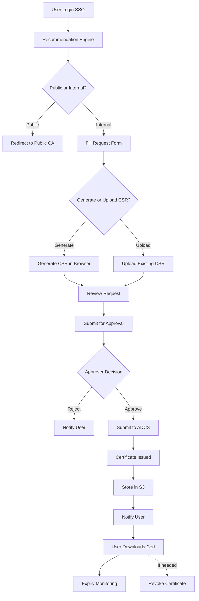

# AWS Certificate Decision Assistant - System Design & Planning

## 📋 Project Overview

The **AWS Certificate Decision Assistant** is a comprehensive web-based platform designed to streamline certificate authority (CA) selection and certificate lifecycle management. The system uses an intelligent decision tree questionnaire to recommend whether users should use a Public CA or Internal CA based on their specific service requirements, then facilitates the entire certificate request, approval, issuance, and management process.

## 🎯 Key Features

### 1. Intelligent Recommendation Engine
- **Multi-step questionnaire** (11+ questions) analyzing service requirements
- **Automated CA recommendation** (Public CA vs Internal CA)
- **Override capability** with mandatory justification for compliance
- **Confidence scoring** for recommendations

### 2. Complete Certificate Lifecycle Management
- **Request Creation** with auto-generated or uploaded CSRs
- **Approval Workflow** with configurable approvers and delegation
- **Automated Issuance** via ADCS integration
- **Certificate Storage** in encrypted S3 buckets
- **Download Management** with format options (PEM, DER, PKCS#12)
- **Revocation Handling** with CRL/OCSP updates
- **Expiry Monitoring** with automated notifications

### 3. Enterprise Integration
- **Single Sign-On (SSO)** with SAML 2.0 / OAuth 2.0
- **ADCS Integration** for certificate issuance
- **Email Notifications** via AWS SES
- **Slack/Teams Integration** (optional)
- **RESTful API** for programmatic access

### 4. Security & Compliance
- **End-to-end encryption** (at rest and in transit)
- **Role-based access control** (User, Approver, Admin, Auditor)
- **Comprehensive audit logging** (10-year retention)
- **SOC 2, GDPR, PCI DSS, HIPAA** compliance ready
- **AWS security best practices** (WAF, GuardDuty, KMS)

### 5. Operational Excellence
- **Multi-AZ deployment** for high availability
- **Auto-scaling** based on demand
- **CloudWatch monitoring** with custom dashboards
- **Automated backups** and disaster recovery
- **Infrastructure as Code** (Terraform)

## 📚 Documentation

This repository contains comprehensive system design and planning documentation:

| Document | Description |
|----------|-------------|
| [**SYSTEM_ARCHITECTURE.md**](./SYSTEM_ARCHITECTURE.md) | High-level system architecture, AWS services, component design |
| [**FUNCTIONAL_REQUIREMENTS.md**](./FUNCTIONAL_REQUIREMENTS.md) | Detailed functional requirements (60+ requirements across 14 categories) |
| [**DATABASE_SCHEMA.md**](./DATABASE_SCHEMA.md) | Complete database schema with 10 tables, views, and indexes |
| [**API_SPECIFICATION.md**](./API_SPECIFICATION.md) | RESTful API documentation with 50+ endpoints |
| [**SECURITY_COMPLIANCE.md**](./SECURITY_COMPLIANCE.md) | Security controls, compliance standards, incident response |
| [**DEPLOYMENT_GUIDE.md**](./DEPLOYMENT_GUIDE.md) | Infrastructure as Code (Terraform), CI/CD pipeline, deployment procedures |
| [**USER_FLOWS.md**](./USER_FLOWS.md) | Detailed user journey flows with UI mockups |
| [**flowchart.md**](./flowchart.md) | Mermaid flowchart of the complete certificate workflow |

## 🏗️ Architecture Overview

```
┌─────────────────────────────────────────────────────────────────┐
│                        Users (Browser)                           │
└────────────────────────────┬────────────────────────────────────┘
                             │ HTTPS
                             ▼
┌─────────────────────────────────────────────────────────────────┐
│                  Application Load Balancer (ALB)                 │
│                    + AWS WAF + SSL/TLS                           │
└────────────────────────────┬────────────────────────────────────┘
                             │
                ┌────────────┴────────────┐
                ▼                         ▼
┌──────────────────────────┐   ┌──────────────────────────┐
│   React/Angular SPA      │   │   Backend API Services   │
│   (S3 + CloudFront)      │   │   (ECS Fargate/Lambda)   │
└──────────────────────────┘   └────────────┬─────────────┘
                                            │
                    ┌───────────────────────┼───────────────────────┐
                    ▼                       ▼                       ▼
        ┌────────────────────┐  ┌────────────────────┐  ┌────────────────────┐
        │   AWS RDS          │  │   AWS S3           │  │   AWS SQS/SNS      │
        │   (PostgreSQL)     │  │   (Certificates)   │  │   (Message Queue)  │
        └────────────────────┘  └────────────────────┘  └────────────────────┘
                                            │
                                            ▼
                                ┌────────────────────────┐
                                │   On-Premise ADCS      │
                                │   (via VPN/DirectConn) │
                                └────────────────────────┘
```

## 🛠️ Technology Stack

### Frontend
- **Framework:** React 18+ with TypeScript or Angular 15+
- **State Management:** Redux Toolkit or NgRx
- **UI Library:** Material-UI or Ant Design
- **Build Tool:** Vite or Webpack

### Backend
- **Runtime:** Node.js (Express/NestJS) or Python (FastAPI/Django)
- **API:** RESTful with JSON
- **Authentication:** JWT from SSO (SAML/OAuth)

### Database
- **Primary:** PostgreSQL 15+ on AWS RDS
- **Cache:** Redis on ElastiCache
- **Search:** (Optional) OpenSearch for audit logs

### Storage
- **Certificates:** AWS S3 with KMS encryption
- **Private Keys:** AWS S3 (separate bucket, restricted access)
- **Audit Logs:** S3 Glacier for long-term retention

### Infrastructure
- **Compute:** ECS Fargate, Lambda
- **Networking:** VPC, ALB, NAT Gateway, VPN/Direct Connect
- **Security:** IAM, KMS, Secrets Manager, WAF, GuardDuty
- **Monitoring:** CloudWatch, X-Ray, CloudTrail
- **IaC:** Terraform

### CI/CD
- **Source Control:** GitHub
- **CI/CD:** GitHub Actions
- **Container Registry:** Amazon ECR
- **Deployment:** Blue/Green via ECS

## 📊 System Workflow



## 🚀 Getting Started

### Prerequisites
- AWS Account with appropriate permissions
- Terraform 1.5+
- Node.js 18+ or Python 3.11+
- Docker
- On-premise ADCS server (or test environment)

### Quick Start

1. **Clone the repository**
   ```bash
   git clone https://github.com/DebasishTripathy13/CA.git
   cd CA
   ```

2. **Review documentation**
   - Read [SYSTEM_ARCHITECTURE.md](./SYSTEM_ARCHITECTURE.md) for overview
   - Review [FUNCTIONAL_REQUIREMENTS.md](./FUNCTIONAL_REQUIREMENTS.md) for features
   - Study [DATABASE_SCHEMA.md](./DATABASE_SCHEMA.md) for data model

3. **Infrastructure deployment**
   - Follow [DEPLOYMENT_GUIDE.md](./DEPLOYMENT_GUIDE.md) for step-by-step instructions
   - Use provided Terraform modules to deploy AWS infrastructure
   - Configure SSO integration
   - Set up ADCS connectivity

4. **Application deployment**
   - Build frontend and backend applications
   - Deploy via CI/CD pipeline (GitHub Actions)
   - Run database migrations
   - Seed initial data

5. **Testing**
   - Access application via ALB URL
   - Test SSO login
   - Complete sample certificate request
   - Verify approval workflow

## 📈 Key Metrics & Monitoring

### Performance Targets
- **API Response Time:** < 200ms (p95)
- **Certificate Issuance:** < 5 minutes (end-to-end)
- **Dashboard Load Time:** < 2 seconds
- **Uptime:** 99.5% (4.38 hours downtime/year)

### Monitoring Dashboards
- **CloudWatch Dashboard:** Real-time metrics, alarms, logs
- **Grafana (optional):** Custom visualizations, anomaly detection
- **Cost Explorer:** Monthly cost tracking and optimization

### Alerting
- **Critical:** RDS failures, certificate issuance failures, security incidents
- **Warning:** High CPU/memory, API errors, pending approvals aging
- **Info:** Certificate expirations, successful deployments

## 💰 Cost Estimation

### Monthly Operating Costs (Production)

| Service | Configuration | Monthly Cost |
|---------|---------------|--------------|
| ECS Fargate | 2 tasks (1 vCPU, 2GB) | $60 |
| RDS PostgreSQL | db.t3.medium, Multi-AZ | $180 |
| S3 | 100GB + requests | $25 |
| ALB | 1 ALB + traffic | $25 |
| NAT Gateway | 2 NAT + 100GB | $90 |
| CloudWatch | Logs + metrics | $50 |
| Other AWS Services | KMS, Secrets Manager, etc. | $14 |
| **Total** | | **~$444/month** |

*Costs can be optimized through Reserved Instances, right-sizing, and S3 Intelligent-Tiering*

## 🔐 Security Highlights

- **Zero Trust Architecture:** All services authenticated and authorized
- **Encryption Everywhere:** TLS 1.2+ in transit, KMS encryption at rest
- **Least Privilege:** IAM roles with minimal required permissions
- **Audit Everything:** Comprehensive logging with 10-year retention
- **Secret Management:** AWS Secrets Manager with automatic rotation
- **Network Isolation:** Private subnets, security groups, WAF
- **Vulnerability Management:** Automated scanning, patching within 48 hours

## 🎓 Best Practices Implemented

### AWS Well-Architected Framework
- ✅ **Operational Excellence:** IaC, automated deployments, monitoring
- ✅ **Security:** Defense in depth, encryption, least privilege
- ✅ **Reliability:** Multi-AZ, auto-scaling, automated backups
- ✅ **Performance Efficiency:** Right-sizing, caching, CDN
- ✅ **Cost Optimization:** Reserved Instances, auto-scaling, lifecycle policies
- ✅ **Sustainability:** Serverless where possible, efficient resource usage

### Development Best Practices
- **Infrastructure as Code:** All infrastructure in version control
- **CI/CD Automation:** Automated testing, building, deployment
- **Observability:** Metrics, logs, traces for all services
- **Disaster Recovery:** Regular backups, tested DR procedures
- **Documentation:** Comprehensive, up-to-date documentation

## 📞 Support & Contribution

### Getting Help
- **Documentation:** Start with the docs in this repository
- **Issues:** Open GitHub issues for bugs or feature requests
- **Discussions:** Use GitHub Discussions for questions

### Contributing
Contributions are welcome! Please:
1. Review existing documentation
2. Follow the coding standards
3. Add tests for new features
4. Update documentation
5. Submit pull requests

## 📝 License

This project is licensed under the [MIT License](LICENSE).

## 🙏 Acknowledgments

- AWS documentation and best practices
- Open source community for tools and libraries
- Contributors and maintainers

## 📅 Project Status

**Current Phase:** System Design & Planning ✅

**Next Steps:**
1. Frontend development (React/Angular SPA)
2. Backend API implementation (Node.js/Python)
3. ADCS integration module
4. SSO integration setup
5. Testing and QA
6. Production deployment

---

**For detailed information, please refer to the individual documentation files listed above.**

Last Updated: January 2024
