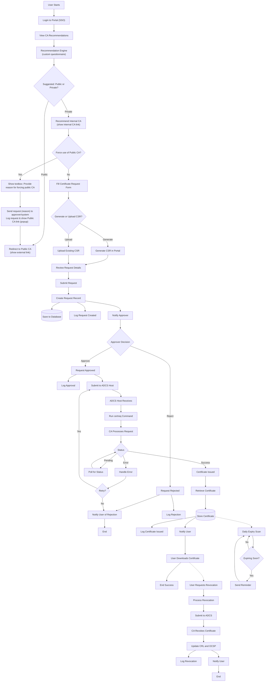

  

# Certificate Decision Assistant

  

A designed workflow for a Certificate Decision Assistant — a portal that guides users through
requesting, issuing, and revoking certificates against an internal ADCS host or an external
public CA, with approval gating and a full audit trail.

**Status: this repo is the design artifact — a complete flowchart of the intended system — not
yet an implemented application.** No backend/frontend code exists here yet; `flowchart.md` is
the source of truth for the intended behavior.

## Workflow

```mermaid
flowchart TB
    Start["User Starts"] --> Step1["Login to Portal (SSO)"]
    Step1 --> Step2["View CA Recommendations"]
    Step2 --> RecEngine["Recommendation Engine\n(custom questionnaire)"]
    RecEngine --> RecChoice{"Suggested: Public or Private?"}
    RecChoice -- Public --> PublicRedirect["Redirect to Public CA\n(show external link)"]
    RecChoice -- Private --> InternalReco["Recommend Internal CA\n(show internal CA link)"]
    InternalReco --> ForceOption{"Force use of Public CA?"}
    ForceOption -- No --> Step3["Fill Certificate Request Form"]
    ForceOption -- Yes --> ForceReason["Show textbox: Provide reason for forcing public CA"]
    ForceReason --> SendForce["Send request (reason) to approver/system\nLog request & show Public CA link (popup)"]
    SendForce --> PublicRedirect
    Step3 --> Choice1{"Generate or Upload CSR?"}
    Choice1 -- Generate --> Gen["Generate CSR in Portal"]
    Choice1 -- Upload --> Upload["Upload Existing CSR"]
    Gen --> Step4["Review Request Details"]
    Upload --> Step4
    Step4 --> Step5["Submit Request"]
    Step5 --> Backend1["Create Request Record"]
    Backend1 --> DB1[("Save to Database")] & Audit1["Log Request Created"] & Step6["Notify Approver"]
    Step6 --> Choice2{"Approver Decision"}
    Choice2 -- Reject --> Reject["Request Rejected"]
    Choice2 -- Approve --> Approve["Request Approved"]
    Reject --> Notify1["Notify User of Rejection"] & Audit2["Log Rejection"]
    Notify1 --> EndReject["End"]
    Approve --> Audit3["Log Approval"] & Step7["Submit to ADCS Host"]
    Step7 --> ADCS1["ADCS Host Receives"]
    ADCS1 --> ADCS2["Run certreq Command"]
    ADCS2 --> ADCS3["CA Processes Request"]
    ADCS3 --> Choice3{"Status"}
    Choice3 -- Error --> Error1["Handle Error"]
    Choice3 -- Pending --> Poll["Poll for Status"]
    Choice3 -- Success --> Step8["Certificate Issued"]
    Error1 --> Choice4{"Retry?"}
    Choice4 -- Yes --> Step7
    Choice4 -- No --> Notify1
    Poll --> Choice3
    Step8 --> ADCS4["Retrieve Certificate"]
    ADCS4 --> DB2[("Store Certificate")]
    DB2 --> Audit4["Log Certificate Issued"] & Step9["Notify User"]
    Step9 --> Step10["User Downloads Certificate"]
    Step10 --> EndSuccess["End Success"]
    Step10 -.-> Revoke1["User Requests Revocation"]
    Revoke1 --> Revoke2["Process Revocation"]
    Revoke2 --> Revoke3["Submit to ADCS"]
    Revoke3 --> Revoke4["CA Revokes Certificate"]
    Revoke4 --> Revoke5["Update CRL and OCSP"]
    Revoke5 --> Audit5["Log Revocation"] & Notify2["Notify User"]
    Notify2 --> EndRevoke["End"]
    DB2 -.-> Monitor1["Daily Expiry Scan"]
    Monitor1 --> Choice5{"Expiring Soon?"}
    Choice5 -- Yes --> Monitor2["Send Reminder"]
    Choice5 -- No --> Monitor1
    Monitor2 --> Monitor1
```

## What it's meant to do

- **Recommend** public vs. private CA per request via a questionnaire, with an override path
  (forced public CA) that requires a logged justification
- **Accept** either a generated-in-portal CSR or an uploaded one
- **Route** requests through an approval step before anything touches the CA
- **Submit** approved requests to an internal ADCS host (`certreq`) with retry-on-error and
  status polling
- **Audit** every step — request creation, approval/rejection, issuance, revocation
- **Monitor** issued certificates for expiry and send reminders proactively
- **Support revocation**, updating CRL/OCSP after an ADCS-side revoke

## Intended technology stack

- **Backend**: Python, Flask, SQLAlchemy
- **Frontend**: JavaScript, React
- **Database**: PostgreSQL
- **Cloud Services**: AWS (S3, etc.)

## Repository contents

- `flowchart.md` — the Mermaid source for the workflow above
- `.github/agents/my-agent.agent.md` — agent config used while developing this design
